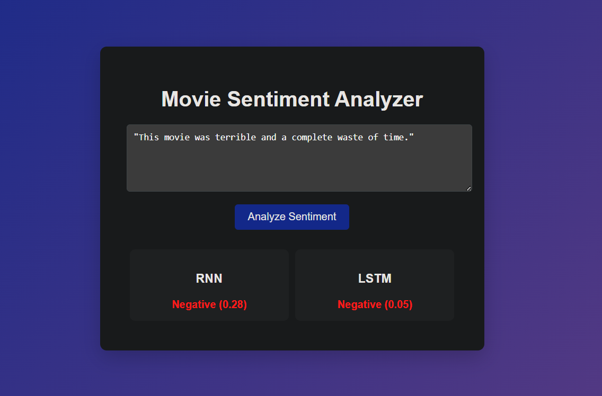

# Sentiment Analysis using RNN & LSTM

This project is a web-based sentiment analysis application that predicts whether a movie review is positive or negative using deep learning models (Simple RNN and LSTM) trained on the IMDB dataset.

🔗 **Live Demo:** [sentiment-analysis-rnn-lstm-vap3.onrender.com](https://sentiment-analysis-rnn-lstm-vap3.onrender.com/)

## Features
- Predicts sentiment (positive/negative) from user input text
- Uses both Simple RNN and LSTM models
- Real-time prediction via Flask web app
- Text preprocessing (tokenization, padding)
- Demonstrates difference between RNN and LSTM

##  Technologies Used
- Python
- Flask
- TensorFlow / Keras
- NumPy
- HTML, CSS, JavaScript

## RNN vs LSTM Comparison

| Aspect | Simple RNN | LSTM |
|---|---|---|
| Architecture | Single hidden state, no gating | Uses input, forget, and output gates |
| Long-term dependencies | Struggles to retain context over long sequences (vanishing gradient) | Retains context better over longer sequences |
| Training speed | Faster, fewer parameters | Slower, more parameters to train |
| Accuracy on longer reviews | Lower, tends to lose earlier context | Higher, handles longer/complex reviews better |
| Use case | Good for short, simple text | Better for nuanced, longer text |

## 🔍 Example

**Input:**
"This movie was absolutely amazing and I loved every moment of it."

**Output:**
Positive (85%)

---

**Input:**
"This movie was terrible and a complete waste of time."

**Output:**
Negative (28%)

## 🧪 Try It Yourself

Copy-paste any of these into the app to test:

**Positive:**
- This movie was absolutely amazing and I loved every moment of it.
- One of the best films I've seen this year, brilliant acting and a gripping story.
- I couldn't stop smiling throughout the entire movie, truly a masterpiece.

**Negative:**
- This movie was terrible and a complete waste of time.
- The plot made no sense and the acting felt forced and flat.
- I was bored the entire time, wouldn't recommend it to anyone.

**Mixed / Neutral (interesting for comparing RNN vs LSTM):**
- The visuals were stunning but the story dragged on for way too long.
- It started strong but the ending completely ruined the experience for me.
